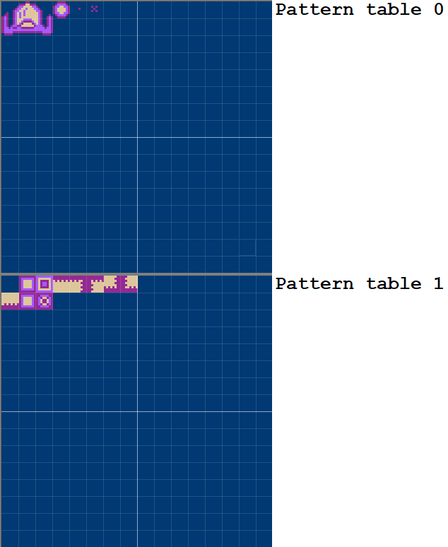
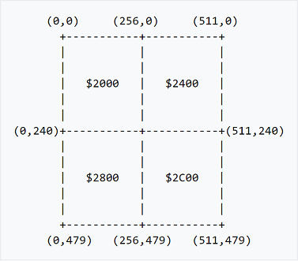
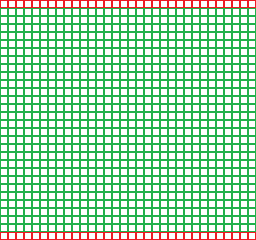
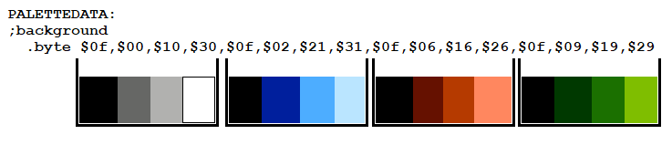
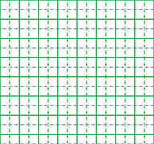
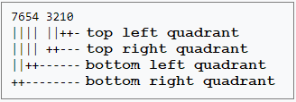
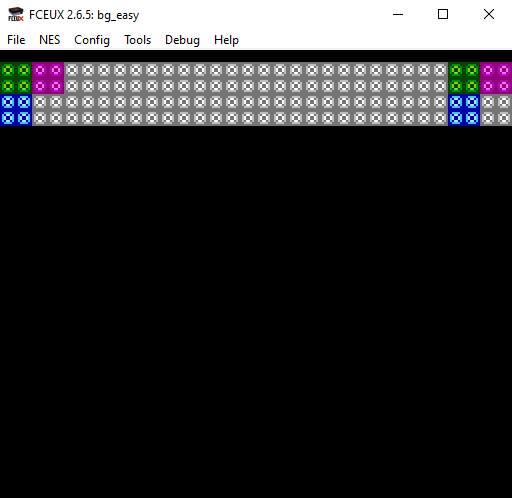

# NES backgrounds

Backgrounds are made up of images held in pattern table 1:



Here we see pattern table 0 (top) and pattern table 1 below. Pattern table 0 is concerned with sprites whilst pattern table 1 is concerned with background graphics. Each 8 * 8 tile is referenced by a byte. The top row in pattern table 0 is referenced with $00 - $0f. The second row from the top is referenced with $10 - $1f and so on down to the bottom row of pattern table 0 which is referenced by $f0 - $ff.

For pattern table 1, the references are the same, so, the top row in pattern table 1 is referenced with $00 - $0f. The second row from the top is referenced with $10 - $1f and so on down to the bottom row of pattern table 1 which is referenced by $f0 - $ff.

Drawing a background on the NES requires three components:

1. A nametable
2. A palette
3. An attribute table

*Nametables* mainly deal with which piece of graphics is displayed for each tile. Additionally, as nametables are read into memory in sequence, they effectively determine the screen position of each tile.

The *palette* is 16 bytes long and is split into 4 groups - each group represents 4 colours. The palette is used along with the attribute table to apply colour to the background tiles.

*Attribute table*

## Nametable

A nametable represents one whole screen of tiles. The nametable holds a byte for each tile on the screen. This byte corresponds with the piece of graphics data held the pattern table 1 which we want to display in that particular tile.

A nametable is a 1024 byte area of memory used by the PPU to lay out backgrounds. Each byte in the nametable controls one 8x8 pixel character cell, and each nametable has 30 rows of 32 tiles each, for 960 ($3C0) bytes; the rest is used by each nametable's attribute table. With each tile being 8x8 pixels, this makes a total of 256x240 pixels in one map, the same size as one full screen.



The NES has four logical nametables, arranged in a 2x2 pattern. Each occupies a 1kb chunk of PPU address space, starting at $2000 at the top left, $2400 at the top right, $2800 at the bottom left, and $2C00 at the bottom right. The NES system board itself has only 2kb of VRAM, enough for two physical nametables. Cartridges with additional ran allow use of all four nametables.



Here we see a NES screen at resolution 256 * 240 pixels. We see that it is covered in 960 tiles. Each tile is 8 * 8 pixels. There are 30 rows of tiles and each row contains 32 tiles. In the above picture, we see that there are 32 tiles at the top and 32 at the bottom coloured red - these tiles will not be rendered on NTSC systems (although we can still manipulate them in our code, they will not be drawn). These tiles *are* drawn on PAL systems.

A full nametable of 960 bytes would look something like this:

```
nametable:
    .byte $01, $05, $05, $00, $00, $05, $05, $05, $05, $05, $05, $05, $05, $05, $05, $05
    .byte $05, $05, $05, $00, $00, $05, $05, $05, $05, $05, $05, $05, $05, $05, $05, $05
    .byte $05, $05, $05, $05, $05, $05, $05, $05, $05, $05, $05, $05, $05, $05, $05, $05
    .byte $05, $05, $05, $05, $05, $05, $05, $05, $05, $05, $05, $05, $05, $05, $05, $05
    .byte $05, $05, $05, $05, $05, $05, $05, $05, $05, $05, $05, $05, $05, $05, $05, $05
    .byte $05, $05, $05, $05, $05, $05, $05, $05, $05, $05, $05, $05, $05, $05, $05, $05
    .byte $05, $05, $05, $05, $05, $05, $05, $05, $05, $05, $05, $05, $05, $05, $05, $05
    .byte $05, $05, $05, $05, $05, $05, $05, $01, $05, $05, $05, $05, $05, $05, $05, $05
     byte $05, $05, $05, $05, $05, $05, $05, $05, $05, $05, $05, $05, $05, $05, $05, $05
    .byte $05, $05, $05, $05, $05, $05, $05, $01, $05, $05, $05, $05, $05, $05, $05, $05
    .byte $01, $05, $05, $00, $00, $05, $05, $05, $05, $05, $05, $05, $05, $05, $05, $05
    .byte $05, $05, $05, $00, $00, $05, $05, $05, $05, $05, $05, $05, $05, $05, $05, $05
    .byte $05, $05, $05, $05, $05, $05, $05, $05, $05, $05, $05, $05, $05, $05, $05, $05
    .byte $05, $05, $05, $05, $05, $05, $05, $05, $05, $05, $05, $05, $05, $05, $05, $05
    .byte $05, $05, $05, $05, $05, $05, $05, $05, $05, $05, $05, $05, $05, $05, $05, $05
    .byte $05, $05, $05, $05, $05, $05, $05, $05, $05, $05, $05, $05, $05, $05, $05, $05
    .byte $05, $05, $05, $05, $05, $05, $05, $05, $05, $05, $05, $05, $05, $05, $05, $05
    .byte $05, $05, $05, $05, $05, $05, $05, $01, $05, $05, $05, $05, $05, $05, $05, $05
     byte $05, $05, $05, $05, $05, $05, $05, $05, $05, $05, $05, $05, $05, $05, $05, $05
    .byte $05, $05, $05, $05, $05, $05, $05, $01, $05, $05, $05, $05, $05, $05, $05, $05
    .byte $01, $05, $05, $00, $00, $05, $05, $05, $05, $05, $05, $05, $05, $05, $05, $05
    .byte $05, $05, $05, $00, $00, $05, $05, $05, $05, $05, $05, $05, $05, $05, $05, $05
    .byte $05, $05, $05, $05, $05, $05, $05, $05, $05, $05, $05, $05, $05, $05, $05, $05
    .byte $05, $05, $05, $05, $05, $05, $05, $05, $05, $05, $05, $05, $05, $05, $05, $05
    .byte $05, $05, $05, $05, $05, $05, $05, $05, $05, $05, $05, $05, $05, $05, $05, $05
    .byte $05, $05, $05, $05, $05, $05, $05, $05, $05, $05, $05, $05, $05, $05, $05, $05
    .byte $05, $05, $05, $05, $05, $05, $05, $05, $05, $05, $05, $05, $05, $05, $05, $05
    .byte $05, $05, $05, $05, $05, $05, $05, $01, $05, $05, $05, $05, $05, $05, $05, $05
     byte $05, $05, $05, $05, $05, $05, $05, $05, $05, $05, $05, $05, $05, $05, $05, $05
    .byte $05, $05, $05, $05, $05, $05, $05, $01, $05, $05, $05, $05, $05, $05, $05, $05
    .byte $01, $05, $05, $00, $00, $05, $05, $05, $05, $05, $05, $05, $05, $05, $05, $05
    .byte $05, $05, $05, $00, $00, $05, $05, $05, $05, $05, $05, $05, $05, $05, $05, $05
    .byte $05, $05, $05, $05, $05, $05, $05, $05, $05, $05, $05, $05, $05, $05, $05, $05
    .byte $05, $05, $05, $05, $05, $05, $05, $05, $05, $05, $05, $05, $05, $05, $05, $05
    .byte $05, $05, $05, $05, $05, $05, $05, $05, $05, $05, $05, $05, $05, $05, $05, $05
    .byte $05, $05, $05, $05, $05, $05, $05, $05, $05, $05, $05, $05, $05, $05, $05, $05
    .byte $05, $05, $05, $05, $05, $05, $05, $05, $05, $05, $05, $05, $05, $05, $05, $05
    .byte $05, $05, $05, $05, $05, $05, $05, $01, $05, $05, $05, $05, $05, $05, $05, $05
     byte $05, $05, $05, $05, $05, $05, $05, $05, $05, $05, $05, $05, $05, $05, $05, $05
    .byte $05, $05, $05, $05, $05, $05, $05, $01, $05, $05, $05, $05, $05, $05, $05, $05
    .byte $01, $05, $05, $00, $00, $05, $05, $05, $05, $05, $05, $05, $05, $05, $05, $05
    .byte $05, $05, $05, $00, $00, $05, $05, $05, $05, $05, $05, $05, $05, $05, $05, $05
    .byte $05, $05, $05, $05, $05, $05, $05, $05, $05, $05, $05, $05, $05, $05, $05, $05
    .byte $05, $05, $05, $05, $05, $05, $05, $05, $05, $05, $05, $05, $05, $05, $05, $05
    .byte $05, $05, $05, $05, $05, $05, $05, $05, $05, $05, $05, $05, $05, $05, $05, $05
    .byte $05, $05, $05, $05, $05, $05, $05, $05, $05, $05, $05, $05, $05, $05, $05, $05
    .byte $05, $05, $05, $05, $05, $05, $05, $05, $05, $05, $05, $05, $05, $05, $05, $05
    .byte $05, $05, $05, $05, $05, $05, $05, $01, $05, $05, $05, $05, $05, $05, $05, $05
     byte $05, $05, $05, $05, $05, $05, $05, $05, $05, $05, $05, $05, $05, $05, $05, $05
    .byte $05, $05, $05, $05, $05, $05, $05, $01, $05, $05, $05, $05, $05, $05, $05, $05
     byte $01, $05, $05, $00, $00, $05, $05, $05, $05, $05, $05, $05, $05, $05, $05, $05
    .byte $05, $05, $05, $00, $00, $05, $05, $05, $05, $05, $05, $05, $05, $05, $05, $05
    .byte $05, $05, $05, $05, $05, $05, $05, $05, $05, $05, $05, $05, $05, $05, $05, $05
    .byte $05, $05, $05, $05, $05, $05, $05, $05, $05, $05, $05, $05, $05, $05, $05, $05
    .byte $05, $05, $05, $05, $05, $05, $05, $05, $05, $05, $05, $05, $05, $05, $05, $05
    .byte $05, $05, $05, $05, $05, $05, $05, $05, $05, $05, $05, $05, $05, $05, $05, $05
    .byte $05, $05, $05, $05, $05, $05, $05, $05, $05, $05, $05, $05, $05, $05, $05, $05
    .byte $05, $05, $05, $05, $05, $05, $05, $01, $05, $05, $05, $05, $05, $05, $05, $05
     byte $05, $05, $05, $05, $05, $05, $05, $05, $05, $05, $05, $05, $05, $05, $05, $05
    .byte $05, $05, $05, $05, $05, $05, $05, $01, $05, $05, $05, $05, $05, $05, $05, $05
```

If we can only loop through a maximum of 256 values, we need a more advanced way of looping - one that will allow us to go above the 256 limit imposed on us by the hardware.

For ease of explanation, *bg_easy.asm* will demonstrate a background pattern limited to 256 bytes. *bg_more_tiles.asm* will demonstrate how to load the full 960 bytes of a nametable using an advanced looping technique.

## Palette

Our palette consists of 16 bytes - and these 16 bytes are grouped into 4 sub groups. A tile can be coloured by one of these sub groups at a time. You'll notice that the first byte of each sub palette is the same - this is known as a 'backdrop colour' and it is essentially used for transparency.



The background palette is held at PPU address $3F00 to $3f0f and the sprite palette is held at PPU address $3F10 to $3f1f.

#### *NEVER use colour $0D on the NES - this colour can damage certain types of TV's.*

## Attribute table

Each nametable has what is known as an 'attribute table' located in memory right after the nametable itself. The attribute table deals with adding palette data to the background.

Each attribute table, starting at $23C0, $27C0, $2BC0, or $2FC0, is arranged as an 8x8 byte array:



An attribute table is split up into 64 segments and each of these 64 segments is further split up into 4 sub segments (these 4 sub segments are often referred to as 'quadrants').

Each of the 64 segments in an attribute table is referenced by a byte and it is common for coders to use binary when working with these particular bytes as we need easy control over each bit in these bytes. 

We use bits 7 & 6 to colour the bottom right quadrant of its parent segment, bits 5 & 4 to colour the bottom left quadrant of its parent segment, bits 3 & 2 to colour the top right quadrant of its parent segment and finally bits 1 & 0 to colour the top left quadrant of its parent segment.



Remember that:

```
00 = 0
01 = 1
10 = 2
11 = 3
```

Remember that our palette is split up into 4 sections. So, for example, setting bits 7 and 6 in an attribute table byte to 00 would select the first palette section to colour the bottom right quadrant of its parent segment. As another example, setting bits 1 and 0 in an attribute table byte to 11 would select the fourth palette section to colour the top left quadrant of its parent segment.

### Screenshots



## How to assemble

Step 1: Assemble asm file into an object file

**ca65 filename.asm -o filename.o -t nes**

Step 2: link the object file to the nes target (yields a .NES rom for use with emulator, tested on Fceux)

**ld65 filename.o -o filename.nes -t nes**

# Info

# Links

## FCEUX:

Emulator used for testing

https://fceux.com/web/home.html

## CC65 (CA65)

Assembler used

https://www.cc65.org/

## More info

See Nerdy Nights tutorial

https://nerdy-nights.nes.science/#main_tutorial-5