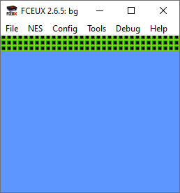

# NES backgrounds

Drawing a background on the NES requires three components:

1. A nametable
2. A palette
3. An attribute table

## Nametable

A nametable represents one whole screen of tiles.

Here we see a NES screen at resolution 256 * 240 pixels. We see that it is covered in 960 tiles. Each tile is 8 * 8 pixels. There are 30 rows of tiles and each row contains 32 tiles. In the above picture, we see that there are 32 tiles at the top and 32 at the bottom coloured red - these tiles will not be rendered on NTSC systems (although we can still maniputate them in our code, they will not be drawn). These tiles *are* drawn on PAL systems.

Pal systems run slower however, an additional 8 pixels are drawn at both the top and bottom of the screen.

NTSC systems run faster however, on both the top and bottom of the screen, 8 pixels are not rendered.

## How to assemble

Step 1: Assemble asm file into an object file

**ca65 filename.asm -o filename.o -t nes**

Step 2: link the object file to the nes target (yields a .NES rom for use with emulator, tested on Fceux)

**ld65 filename.o -o filename.nes -t nes**

# Info

# Links

## FCEUX:

Emulator used for testing

https://fceux.com/web/home.html

## CC65 (CA65)

Assembler used

https://www.cc65.org/

## More info

See Nerdy Nights tutorial

https://nerdy-nights.nes.science/#main_tutorial-5